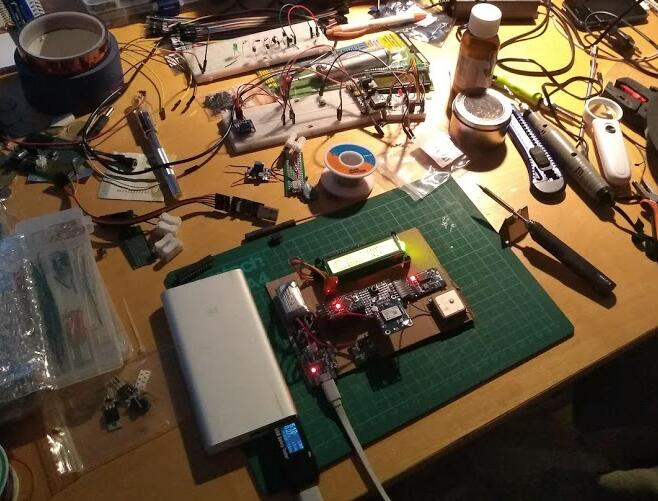

# A battery-powered, GPS-synced, real-time clock.

# Bill of materials

- A Pro-Mini ATMEGA328p holds the brains of the operation.
- 1602 LCD screen shows the time, as well as the country selection menu.
- GY-NEO6MV2 GPS receiver.
- Single (debounced) button navigates the country selection menu
- DS3231 holds the real-time even when the circuit is powered down.
- TP4056/LiPo powers the circuit

# In action

Here's a video of the country selection process and its impact on the rendered time:

# Conclusion

A nice afternoon of hacking :-)
